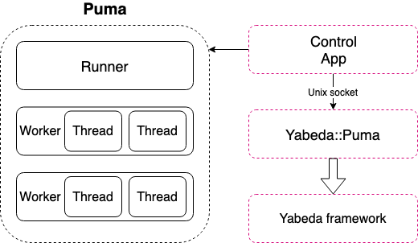
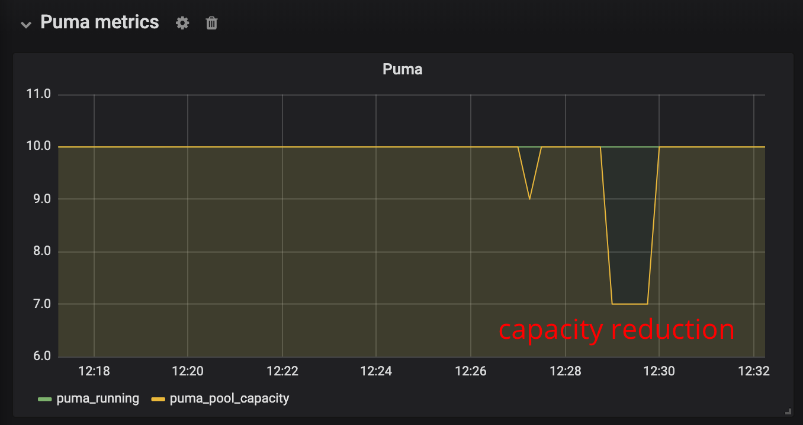

<a href="https://amplifr.com/?utm_source=yabeda-puma-plugin">
  
</a>

# 

Built-in metrics for [Puma](https://github.com/puma/puma) web server monitoring out of the box! Part of the [yabeda](https://github.com/yabeda-rb/yabeda) suite.

## Metrics

Works as the Puma plugin and provides following metrics:
 - `puma_workers` - the number of running puma workers
 - `puma_booted_workers` - the number of booted puma workers
 - `puma_old_workers` - the number of old puma worker

Segmented by the worker (index of the worker):
 - `puma_pool_capacity` - the capacity of each worker: the number of requests that the server is capable of taking right now. More details are [here](https://github.com/puma/puma/blob/0f8b10737e36fc24cdd572f76a739659b5fad9cb/lib/puma/server.rb#L167).
 - `puma_running` - the number of running threads (spawned threads) for any puma worker
 - `puma_max_threads` - preconfigured maximum number of worker threads
 - `puma_backlog` - the number of backlog threads, the number of connections in that worker's "todo" set waiting for a worker thread.

## Installation

Add this line to your application's Gemfile:

```ruby
gem 'yabeda-puma-plugin'
```

And then execute:

    $ bundle

## Usage

### Collecting metrics

Add those 2 lines of code to your `config/puma.rb` file:
```ruby
activate_control_app
plugin :yabeda
```
It will activate default puma control application working over the unix socket, and runs the `yabeda` puma plugin, for registering and collecting the metrics.

> **Note**
>
> In case if you're **not** using Rails, don't forget configure Yabeda manually either in your app initialization or in Puma configuration hook:
> ```ruby
> # config/puma.rb
> before_fork do
>   Yabeda.configure!
> end
> ```
> See [yabeda usage](https://github.com/yabeda-rb/yabeda#usage) for more information.

### Exposing metrics

Some monitoring system agents (like NewRelic or DataDog) will send metrics automatically in the background. But for some of monitoring systems (like Prometheus) you have to explicitly set up metrics export.

#### Prometheus

##### On the same endpoint with your application

For non-Rails applications place following line in your `config.ru` _before_ running your application:

```ruby
use Yabeda::Prometheus::Exporter, path: "/metrics"
```

In Ruby on Rails applications you can add following line in `config/routes.rb` instead:

```ruby
mount Yabeda::Prometheus::Exporter => "/metrics"
```

In both cases your Puma instance metrics (along with your application metrics) will be available at `/metrics` endpoint.

##### On different port

Sometimes you don't want to expose metrics publicly for security reasons. For that case prometheus exporter plugin is bundled with this gem.

Don't forget to add either `yabeda-prometheus` or `yabeda-prometheus-mmap` gem into your `Gemfile`!

Add this plugin into your `config/puma.rb`:

```ruby
plugin :yabeda_prometheus
```

By default metrics will be available at `http://0.0.0.0:9394/metrics`.

Bind host, port, and path can be controlled either by config file option `prometheus_exporter_url`:

```ruby
# config/puma.rb
prometheus_exporter_url "tcp://127.0.0.1:9395/shmetrics"
```

Or by environment variables `PROMETHEUS_EXPORTER_URL`, `PROMETHEUS_EXPORTER_BIND`, `PROMETHEUS_EXPORTER_PORT`, and `PROMETHEUS_EXPORTER_PATH` (takes precedence over configuration option).


## Details

In accordance with the [architecture](https://github.com/puma/puma/blob/master/docs/architecture.md) of the puma web server lets look how it works:

.


For the configuration above, we will have the list of metrics (with help of `yabeda-prometheus` exporter):
```
GET /metrics

puma_backlog{index="0"} 0
puma_backlog{index="1"} 0
puma_running{index="0"} 5
puma_running{index="1"} 5
puma_pool_capacity{index="0"} 1
puma_pool_capacity{index="1"} 5
puma_max_threads{index="0"} 5
puma_max_threads{index="1"} 5
puma_workers 2
puma_booted_workers 2
puma_old_workers 0
```

See also the grafana screenshot of monitoring puma pool size and it's capacity when application is overloaded:

.


## Roadmap (TODO or Help wanted)

- Collect also `control-gc` puma metrics

## Development with Docker

Get local development environment working and tests running is very easy with docker-compose:
```bash
docker-compose run app bundle
docker-compose run app bundle exec rspec
```

## Contributing

Bug reports and pull requests are welcome on GitHub at https://github.com/yabeda-rb/yabeda-puma-plugin.

### Releasing

1. Bump version number in `lib/yabeda/puma/plugin/version.rb`

   In case of pre-releases keep in mind [rubygems/rubygems#3086](https://github.com/rubygems/rubygems/issues/3086) and check version with command like `Gem::Version.new(Yabeda::VERSION).to_s`

2. Fill `CHANGELOG.md` with missing changes, add header with version and date.

3. Make a commit:

   ```sh
   git add lib/yabeda/puma/plugin/version.rb CHANGELOG.md
   version=$(ruby -r ./lib/yabeda/puma/plugin/version.rb -e "puts Gem::Version.new(Yabeda::Puma::Plugin::VERSION)")
   git commit --message="${version}: " --edit
   ```

4. Create annotated tag:

   ```sh
   git tag v${version} --annotate --message="${version}: " --edit --sign
   ```

5. Fill version name into subject line and (optionally) some description (list of changes will be taken from changelog and appended automatically)

6. Push it:

   ```sh
   git push --follow-tags
   ```

7. GitHub Actions will create a new release, build and push gem into RubyGems! You're done!

## License

The gem is available as open source under the terms of the [MIT License](https://opensource.org/licenses/MIT).
